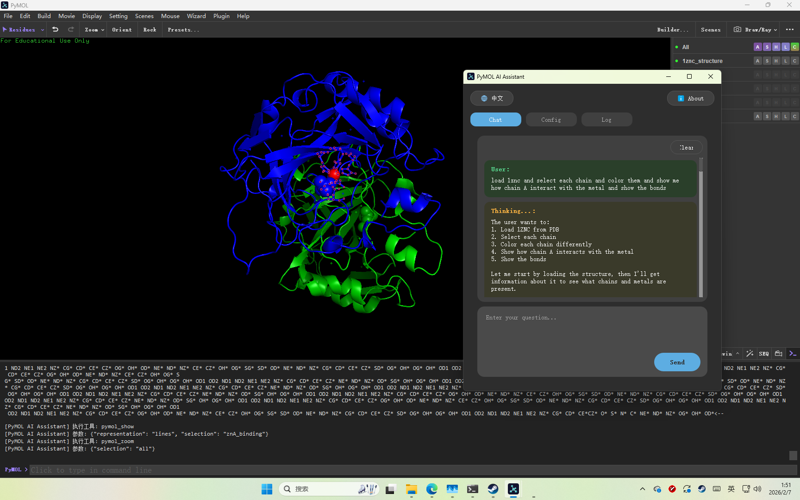
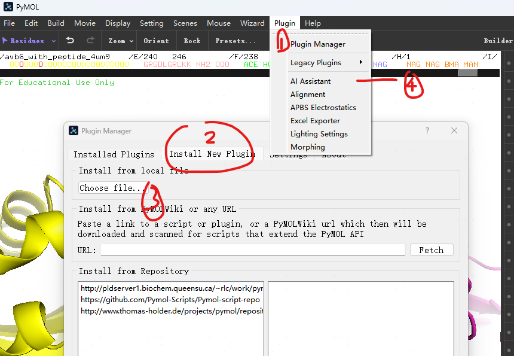
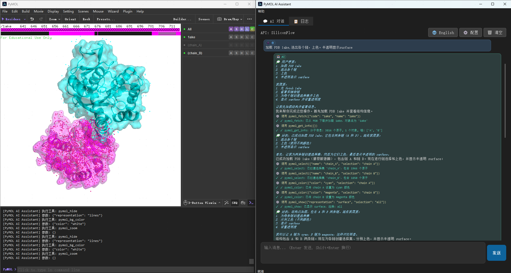
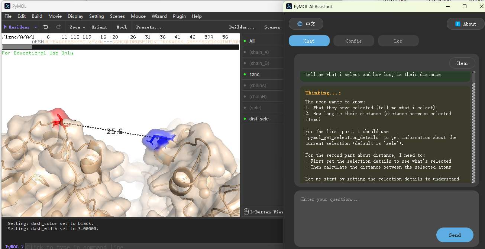
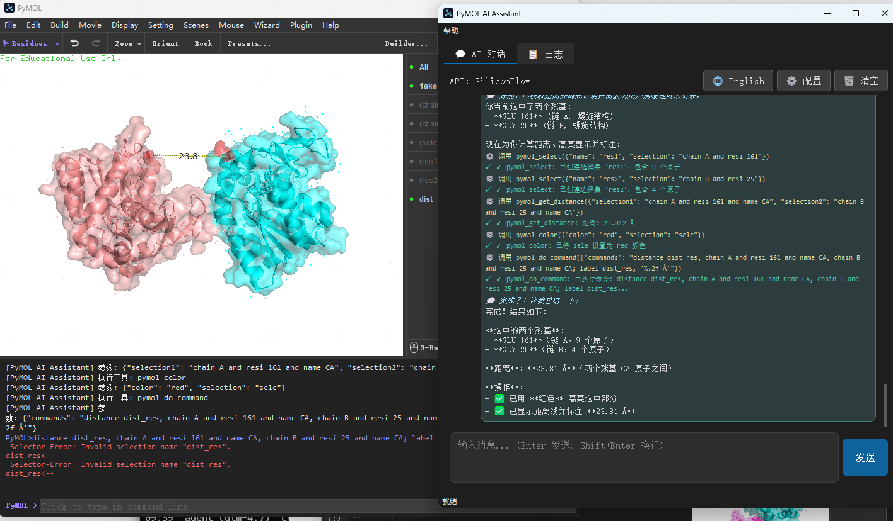

# PyMOL AI Assistant Plugin

[](https://github.com/Masterchiefm/pymol-ai-assistant/releases)
[](https://www.python.org/)
[](LICENSE)

> **Control PyMOL with natural language. Make molecular visualization simple and efficient.**



As shown in the screenshot, you only need to describe your needs in everyday language, and the AI will directly control PyMOL to complete complex molecular visualization tasks.

---

## 🌐 Repositories

This project is maintained simultaneously on GitHub and Gitee:

| Platform | URL | Recommendation |
|----------|-----|----------------|
| **GitHub** | https://github.com/Masterchiefm/pymol-ai-assistant | ⭐ International |
| **Gitee** | https://gitee.com/MasterChiefm/pymol-ai-assistant | 🇨🇳 China (Recommended) |

> **Tip**: Users in China are recommended to use Gitee for faster and more stable download speeds.

---

## ✨ Features

| Feature | Description |
|---------|-------------|
| 🤖 **AI Chat** | Control PyMOL with natural language, no need to memorize complex commands |
| 🌊 **Streaming** | Real-time display of AI thinking process and output with color distinction |
| 🔧 **Tool Calling** | AI can directly operate PyMOL: load structures, set styles, save images, etc. |
| ⚙️ **Config Management** | Support multiple API configs (SiliconFlow, OpenAI, etc.), import/export supported |
| 📋 **Logging** | Record all conversations and tool calls, with filtering and export |
| 🌐 **Bilingual** | One-click switching between Chinese/English interface, language preference auto-saved |
| 📜 **Chat History** | View complete chat_history JSON for debugging and analysis |
| 📦 **Auto Dependencies** | Automatically check and install required dependencies on installation |

---

## 📥 Installation

### Install via Plugin Manager

1. **Download Plugin**
   - GitHub: [Releases Page](https://github.com/Masterchiefm/pymol-ai-assistant/releases/latest)
   - Gitee: [Releases Page](https://gitee.com/MasterChiefm/pymol-ai-assistant/releases)
   - Download `pymol-ai-assistant.zip`

2. **Installation Steps**
   
   
   
   - Open PyMOL → Plugin → Plugin Manager
   - Click "Install New Plugin"
   - Select the downloaded zip file
   - Restart PyMOL

---

## 🚀 Usage

### Quick Start

1. Launch PyMOL
2. Menu bar: Plugin → AI Assistant
3. Configure API for first-time use:
   
   
   
   - Click "⚙️ Config" button (or "⚙️ 配置" in Chinese interface)
   - Add API configuration (URL, Key, Model)
   - Supports SiliconFlow, OpenAI, and other OpenAI API-compatible services

4. (Optional) Click "🌐 中文" to switch to Chinese interface. Language preference is automatically saved.

### API Configuration Example

#### SiliconFlow (Recommended for China users)

```yaml
API URL: https://api.siliconflow.cn/v1
Recommended Models:
  - Pro/moonshotai/Kimi-K2.5  # Best overall, paid
  - Pro/zai-org/GLM-4.7       # Paid
  - deepseek-ai/DeepSeek-V3.2 # Free model
```

**Registration Bonus**:
- Get 16 CNY voucher with invite link: https://cloud.siliconflow.cn/i/Su2ao83G
- Or visit Kimi official website for monthly plans

After configuration, type commands in the input box and press **Enter** to send.

---

## 🖥️ Interface Guide

### Tab Layout

| Tab | Content |
|-----|---------|
| 💬 **Chat** | Chat interaction interface |
| 📋 **Logs** | System logs and debug information |
| 📜 **History** | View complete chat_history JSON |

### Message Styles

- 👤 **User Message**: Blue background, displayed on right
- 🤖 **AI Message**: Green background, displayed on left
  - 💭 **Thinking Process**: Gray italic
  - **Formal Output**: Normal text
  - ⚙️ **Tool Call**: Orange display
  - ✓ **Tool Result**: Green/Red status

---

## 💡 Example Commands

### Example 1: Load and Visualize Molecule
```
Load PDB 1ake, select each chain and color them, display surface with transparency
```


### Example 2: Measure Distance
```
What is the distance between the two residues I selected? Show me the measurement.
```



### More Examples

```
Rotate view 90 degrees, then save as image
```

```
Create a selection of all atoms in chain A
```

```
Execute PyMOL script /path/to/script.pml
```

```
Run command: load 1ake; show cartoon; color chain
```

```
Load and run Python script /path/to/setup.py
```

---

## 📄 License

This project is licensed under the MIT License - see the [LICENSE](LICENSE) file for details.

---

## 🤝 Contributing

Issues and Pull Requests are welcome!

---

## ☕ Support

If this project helps you, please consider giving it a Star ⭐!

---

## 📝 Special Statement

**This project was primarily developed with the assistance of AI models:**
- **Kimi K2.5** (Moonshot AI) - Core architecture and functionality
- **GLM-4.7** (Zhipu AI) - Code optimization and feature enhancement

With the help of AI, the developer realized this powerful PyMOL intelligent plugin by describing requirements in natural language.

---

**Made with ❤️ and AI (Kimi K2.5 & GLM-4.7)**

---

## 🌐 Languages

- [简体中文](README_zh.md)
- **English** (Current)
